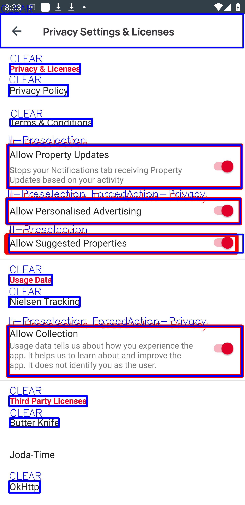
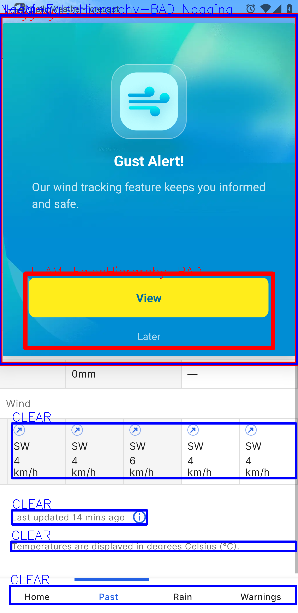
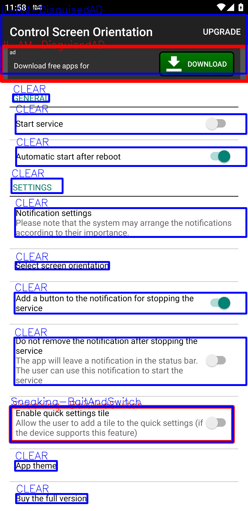
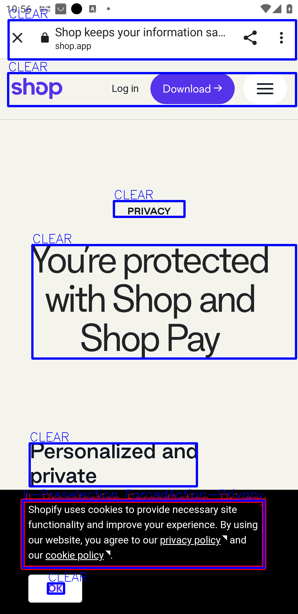

## Environment
 1. Python=3.9 
 2. torch=2.1.1 
 3. transformers=4.40.2 
 4. FastRCNN configuration follows [UIGuard](https://github.com/chenjshnn/UIST23-UIGuard) 
 5. GPU Server - Ubuntu 20.04, NVIDIA RTX A6000.

## How to Use
1. The Dark Pattern Detector (DPD) model is trained by:
 
```python
python trainer.py --help

Usage: trainer.py [OPTIONS]
Options:
  --use-class-weight BOOLEAN      	Enable class weight.
  --use-negative-sampling BOOLEAN 	Enable negative sampling.
  --use-balance-augmentation BOOLEAN Enable balanced augmentation.
  --dl-model [RESNET|BERT|BERT-RESNET-F|BERT-RESNET-NF]
                                  Choose a model type.
  --gpu INTEGER                   Choose a GPU.
  --output-pred TEXT              Output predict file.
  --help                          Show this message and exit.
```
In order to train the Bert-ResNet model with the supports of class weight, negative sampling and data augmentation, it should follow the steps:
```
python trainer.py --dl-model BERT --use-class-weight True --use-negative-sampling True --use-balance-augmentation True

python trainer.py --dl-model RESNET --use-class-weight True --use-negative-sampling True --use-balance-augmentation True

python trainer_support_nodp.py --dl-model BERT-RESNET-F --use-class-weight True --use-negative-sampling True --use-balance-augmentation True --output-pred pred_outputs.pk
```

2. Refine the predictions of DPD by the Ruler.
```python
python ruler.py --help

Usage: ruler.py [OPTIONS]
Options:
  --input-pred TEXT  Input a predict file.
  --help             Show this message and exit.
```

3. The UI element grouping tool divides a mobile UI into a list of groups of UI elements. Here are examples of UI elements after grouping.

<p float="left">
  
   
  
   
  
</p>

```python
python ui_group.py --help

Usage: ui_group.py [OPTIONS]

Options:
  --image-path TEXT  Root path of images.
  --help             Show this message and exit.
```
